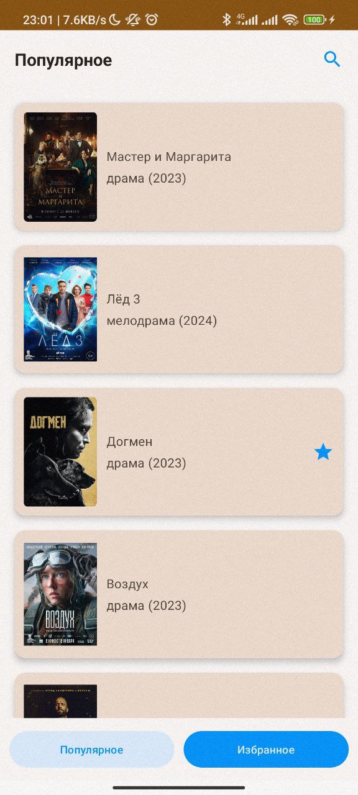

Тестовое задание для отбора на Финтех Android зима 2024.
Цель задания - написать приложение для просмотра списка фильмов с кинопоиска.

## Использованные библиотеки

Проект написан на Kotlin. UI написан с помощью Jetpack Compose.
Также испоьзованы:

* Dagger-Hilt - для внедрения зависимостей
* Retrofit - для работы с  API Кинопоиска
* Room - для локальной базой данных
* Compose Navigation - для навигации между экранами
* Сoil - для асинхронной подгрузки изображений

## Функционал приложения

#### Отображение списка популярных фильмов.

#### Отображение детальной информации о выбранном фильме.

#### Сохранение и удаление фильмов в избранное и из него.

#### Поиск по названию фильма в списке популярных фильмов и в избранном.

#### Aдаптивное отображение списка фильмов - при повороте экрана также отображается информация о выбранном фильме.

#### При отстувии сети, пользователь уведомляется об ошибках

